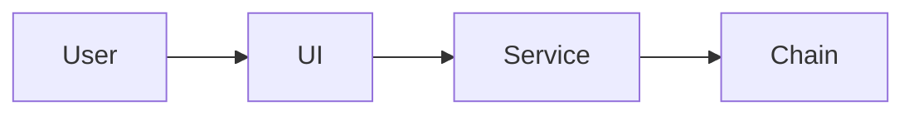
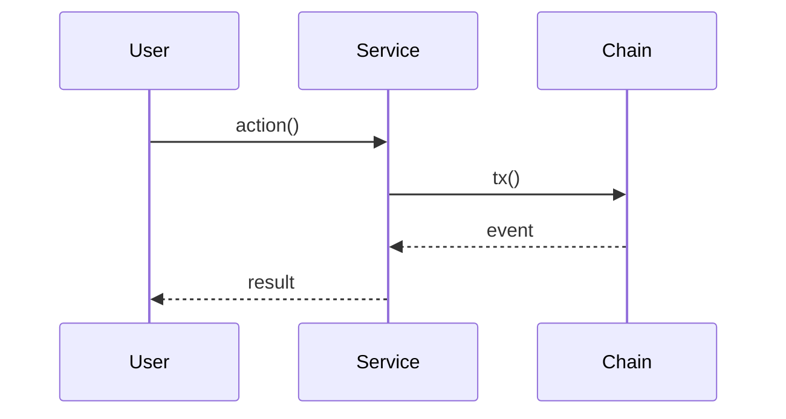

# [板块短名] · [一句话目标，10-15 字]

<!--
  ============================================================================
  深度模板（适用 4/18 份板块：架构决定型 / 五维全栈 / 跨多系统）。
  约 400-600 行。
  在中模板 8 段基础上增加 4 段：
    - 1.5 架构图（mermaid 依赖图 + 时序图）
    - 3.5 接口冻结（合约 ABI / API schema / event 格式）
    - 5.5 端到端测试用例（编号 + 输入 + 期望输出）
    - 7.5 回滚演练（可重复的脚本）
  填完后必须删掉所有 <!-- ... --> 注释。
  违反 README.md §2 全局约束的内容会被退回。
  ============================================================================
-->

| 元数据 | 值 |
|---|---|
| 周次 | W{n}.{m}                                  <!-- 必须 W3.1 这种格式 -->
| 优先级 | 必做                                       <!-- 深模板默认必做 -->
| 工作量 | N 工作日（或 N-M 工作日区间）                <!-- 实事求是 -->
| 依赖 | [板块名](相对路径), ...                       <!-- 没依赖填「无」 -->
| 启用后赋能 | [板块名](相对路径), ...                  <!-- 谁需要等本板块完成 -->
| 状态 | 📋 待开始                                 <!-- 见 README §2.13 -->

---

## 1. 目标与背景

<!-- 5-8 行 -->

### 1.1 为什么做

[填：当前实现的缺陷或架构限制，为何必须升级]

### 1.2 做完后

- **用户视角**：[填]
- **开发者视角**：[填]
- **运维视角**：[填，深模板特有]

### 1.3 不做什么

- [ ] [明确剔除项 1]
- [ ] [明确剔除项 2]

### 1.4 关键 KPI

- [指标 1：数字化目标]
- [指标 2]

### 1.5 架构图（深模板特有）

<!--
  必须画 2 张 mermaid：
  (1) 组件依赖图（flowchart）：本板块组件 + 上下游接入点
  (2) 关键路径时序图（sequenceDiagram）：1 个最典型用户流程
  注意 README §2.2：节点 ≥ 8 个的流程图改 bullet，不画 mermaid
-->

**组件依赖**：



**关键时序**（[流程名]）：



---

## 2. 当前现状（起点）

<!--
  深模板要列更详尽：所有相关文件 + 关键代码 + 数据流痛点
  3 段（共 50-80 行）
-->

### 2.1 现有架构

[2-3 段文字描述当前架构，引用 docs/testnet-deployment/{x}.md 章节]

### 2.2 现有实现

主入口 1：[`相对路径`](../../相对路径) L{x}-L{y}

```startLine:endLine:相对路径
[5-15 行关键代码]
```

主入口 2：[`相对路径`](../../相对路径) L{x}-L{y}

```startLine:endLine:相对路径
[5-15 行关键代码]
```

### 2.3 涉及文件清单（要改 / 要建）

**要改**（按目录组织）：
- 合约层：
  - [`...`](../../...) - [改动]
- 服务层：
  - [`...`](../../...) - [改动]
- 部署层：
  - [`...`](../../...) - [改动]
- 文档层：
  - [`...`](../../...) - [改动]

**要建**：
- `path/new1.sol` - [用途]
- `path/new2.ts` - [用途]

### 2.4 缺什么

- [ ] [缺失能力 1]
- [ ] [缺失能力 2]
- [ ] [缺失能力 3]

---

## 3. 目标产物（终点）

### 3.1 新文件清单

| 路径 | 用途 | 行数粗估 |
|------|------|---------|
| `...` | [一句话] | ~150 |

### 3.2 修改文件清单

| 路径 | 改动要点 |
|------|---------|
| [`...`](../../...) | [bullet] |

### 3.3 新增能力

- **合约方法**：`function foo(...)`、`event Bar(...)`
- **API endpoint**：`POST /api/x` → `{...}`
- **env 变量**：`X_FOO`、`X_BAR`
- **verify 脚本**：`bash verify/X.sh`

### 3.4 接口冻结（深模板特有）

<!--
  这一段是深模板的核心：在本板块之外（其他板块、外部消费者）能依赖的
  接口必须列出**精确签名 + 不变量**。一旦冻结，后续修改要走 ADR。
  覆盖：合约 ABI / REST schema / event 格式 / TypeScript SDK 接口
-->

**合约 ABI（冻结）**：

```solidity
// contracts/src/X.sol
interface IX {
    event Foo(address indexed user, uint256 amount);
    function bar(address user, uint256 amount) external returns (bool);
}
```

**REST API（冻结）**：

```http
GET /api/x/:id
Response 200:
{
  "id": "string",
  "status": "ok" | "pending" | "failed",
  "data": { ... }
}
```

**Event schema（冻结，subgraph 消费）**：

```
event Foo(
  address indexed user,    // 必须 indexed（subgraph filter）
  uint256 amount,
  bytes32 indexed bridgeId
)
```

**TypeScript SDK 接口（冻结）**：

```ts
// packages/sdk/src/x.ts
export interface XClient {
  foo(user: string, amount: bigint): Promise<TxReceipt>;
  onBar(handler: (e: BarEvent) => void): Unsubscribe;
}
```

---

## 4. 设计决策与已知坑

<!--
  深模板的此段必须更厚（60-120 行）：
  - 至少 3 个关键技术选型对比
  - 兼容性约束写明每条的"破坏者赔偿"
  - 已知坑至少 5 条
  - 安全考量段（深模板特有）
-->

### 4.1 关键选型

**A. [选项类别 1]**

- 候选：X / Y / Z
- 选 X：[理由 + benchmark + link]
- 弃 Y：[原因]
- 弃 Z：[原因]

**B. [选项类别 2]**

[同上结构]

**C. [选项类别 3]**

[同上结构]

### 4.2 版本 pinning

| 依赖 | 版本 | 锁定理由 |
|------|------|---------|
| `npm-package` | `1.2.3` | 1.3.x 有 breaking change（link） |
| `solc` | `0.8.24` | 与 BSC fork 一致 |
| `docker image` | `redis:7.2.4-alpine@sha256:...` | 复现性 |

### 4.3 兼容性约束（破坏者赔偿）

- **不允许改 `event Foo` indexed 顺序**：会让所有 subgraph reindex（成本 ≥ 24h）
- **不允许改 `XClient.foo` 签名**：所有 UI 都依赖
- **不允许去掉 `state.json` 字段 `bar`**：升级时旧 relayer 读不到会崩

### 4.4 已知坑

1. **[症状]** → 规避：[做法 + 验证方法]
2. **[症状]** → 规避：[做法]
3. **[症状]** → 规避：[做法]
4. **[症状]** → 规避：[做法]
5. **[症状]** → 规避：[做法]

### 4.5 安全考量（深模板特有）

- **威胁模型**：[谁是攻击者，能做什么]
- **关键防御**：
  - [防御 1：reentrancy / replay / front-run 等]
  - [防御 2]
- **审计准备**：本板块在 [93-audit-ready-package](../90-compliance/93-audit-ready-package.md) 中的覆盖范围

---

## 5. 实现步骤（按顺序）

<!--
  深模板必须 8-12 个 Step（共 200-400 行）。
  每个 Step 独立可验证。
  每 3-4 个 Step 设一个"中间检查点"（可以停在这里晚上下班）。
-->

### Step 1: [短动词标题]

[3-5 行说明]

操作：
- a) ...
- b) ...

```ts
// 新代码示例（≤15 行）
```

**完成判定**：[机器可验证]

### Step 2-12: ...

<!-- 同 Step 1 格式 -->

### 中间检查点

- 经过 Step 4 后：跑 [`verify/X-partial-1.sh`](...) 应全绿
- 经过 Step 8 后：跑 [`verify/X-partial-2.sh`](...) 应全绿

---

## 6. 验收

<!--
  深模板要求 8-12 条验收（含 E2E + 性能 + 监控 + 文档）。
-->

### 6.1 单元 / 集成

- [ ] `forge test --match-contract X` 通过 ≥ N 用例
- [ ] `npm test -- --coverage` 覆盖率 ≥ 70%
- [ ] `bash verify/X.sh` 全绿

### 6.2 端到端

- [ ] `bash verify/X-e2e.sh` 全绿（详见 §6.5 用例）

### 6.3 性能

- [ ] `bash bench/X.sh` 输出 p95 < {threshold}
- [ ] 关键操作 gas 消耗 ≤ {threshold}

### 6.4 监控

- [ ] Prometheus 出现 `metric_{x}` 且持续 30 分钟有数据
- [ ] Grafana dashboard `{name}` 全 panel 渲染
- [ ] Alertmanager 无 firing

### 6.5 端到端测试用例（深模板特有）

<!--
  详尽列出每个用例：编号 / 前置 / 输入 / 期望输出 / 验证命令
  深模板要求 ≥ 5 个 E2E 用例。
-->

**E2E-01：典型成功路径**

- 前置：[环境状态]
- 输入：`bash -c "..."`
- 期望输出：
  ```json
  {"status": "ok", "id": "..."}
  ```
- 验证命令：`curl ... | jq .status` → `"ok"`

**E2E-02：边界条件 A**

[同 E2E-01 结构]

**E2E-03：错误处理 - 上游失败**

[同上]

**E2E-04：错误处理 - 输入越界**

[同上]

**E2E-05：性能 - 并发 N 笔**

[同上]

---

## 7. 风险与回退

<!--
  深模板要求 ≥ 4 条风险 + 1 个完整回滚演练。
-->

### 7.1 风险清单

| 风险 | 概率 | 影响 | 降级方案 |
|------|------|------|---------|
| [风险 1] | 中 | 高 | [env 开关] |
| [风险 2] | 低 | 高 | [手动 fallback] |
| [风险 3] | 中 | 中 | [限流] |
| [风险 4] | 低 | 低 | [无须处理，记录] |

### 7.2 回滚演练（深模板特有）

<!--
  写一段可重复执行的 shell（在测试环境真跑过的）回滚脚本。
  目的：上线后第 N 天发现严重 bug，能 5 分钟回到上一稳定态。
-->

```bash
# rollback-X.sh · 严重 bug 应急回滚
set -euo pipefail

# 1. 停服务
docker compose -f compose/X.compose.yml down

# 2. 回退镜像（用上一个 stable tag）
export X_IMAGE_TAG=$(cat .last-stable-tag)

# 3. 回退合约（如适用）
# 如果合约升级方案是「不可升级 + 重新部署」，则切换 env 指向旧地址：
sed -i.bak 's/X_CONTRACT=.*/X_CONTRACT='"$OLD_X_CONTRACT"'/' secrets.env

# 4. 重启
docker compose -f compose/X.compose.yml up -d

# 5. 验证
bash verify/X.sh

# 6. Slack 通知
echo "🔙 X 已回滚到 $X_IMAGE_TAG / $OLD_X_CONTRACT" | slack-cli send '#alerts'
```

**完成判定**：以上脚本在 staging 环境跑 1 次全绿。

---

## 8. 完成后必做

```bash
# 1. commit (深模板鼓励多个小 commit 而不是一个大 commit)
git log --oneline | head -5   # 检查 commit 颗粒度

# 2. PR description 必须包含：
#    - 链接到本板块文档
#    - 列出 §3 所有产物的 checkbox（全勾上）
#    - 列出 §6 验收的执行截图/日志

# 3. 更新进度
# - docs/dev-plan/README.md §4 全局进度表本行
# - 本板块文档 §Changelog 新增条目（深模板要求 30-80 行详述决策与产物）

# 4. Slack 通知（按 README §2.9 模板 A + 模板 B 双发，因为深模板通常是里程碑）

# 5. 文档同步
# - 改 script/testnet/{模块}/README.md
# - 改 script/testnet/install.sh（新 stage）
# - 改 script/testnet/doctor.sh（新检查项）
# - 改 docs/testnet-deployment/{对应章节}.md（用户手册同步）

# 6. 接口冻结公告
# - 把 §3.4 接口冻结贴到 Slack #devops
# - 发邮件给所有下游板块实施者
```

---

## 9. 参考

- 上游协议：[`org/repo`](https://github.com/...) §x
- 同类项目案例：[`org/repo`](https://github.com/...) commit `abc1234`
- BSC 文档：[Hardfork {name}](https://docs.bnbchain.org/...) §x
- 项目内：[`相对路径`](../../相对路径)
- 历史 ADR：本板块 §Changelog 与 §6「关键决策」中记录

---

## Changelog

| 日期 | 变更 | 实施者 |
|------|------|--------|
| YYYY-MM-DD | 创建 | [name] |
