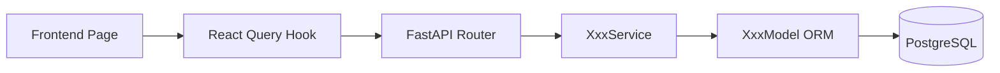
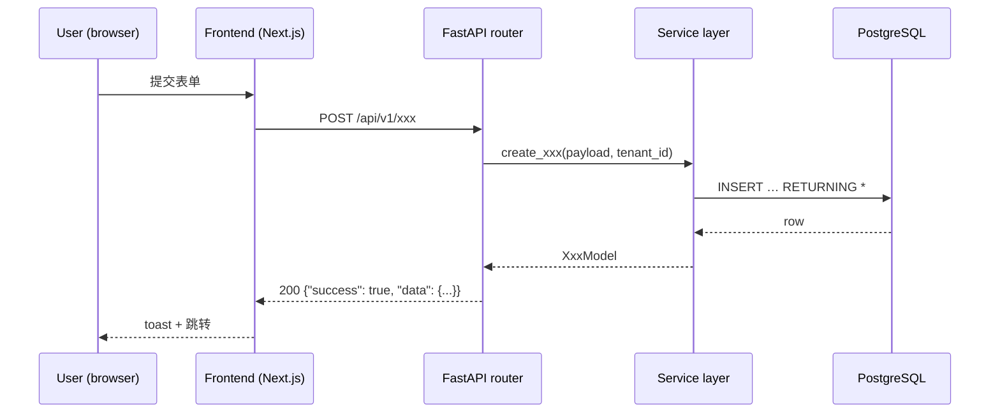

# [板块短名] · [一句话目标，10-15 字]

<!--
  ============================================================================
  深度模板（架构定义型 / 跨栈一致性 / 大型 issue）。
  约 400-600 行。
  在中模板 8 段基础上增加 4 段：
    - 1.5 架构图（mermaid 依赖图 + 时序图）
    - 3.4 接口冻结（路由 schema / Pydantic 模型 / 前端 TS 类型 / DB schema）
    - 6.5 端到端测试用例（编号 + 输入 + 期望输出）
    - 7.2 回滚演练（可重复执行的脚本）
  填完后必须删掉所有 <!-- ... --> 注释。
  违反 README.md §2 全局约束的内容会被退回。
  Project: this repo is a multi-tenant CRM (FastAPI + SQLAlchemy 2.x async + PostgreSQL).
  深模板适用范围：单个 issue 跨 DB schema → ORM → service → router → frontend → tests
  五层的大改动；或确定其他 issue 必须遵循的接口契约。中模板就够用的不要硬上深模板。
  ============================================================================
-->

| 元数据 | 值 |
|---|---|
| Issue | #{n}                                       <!-- GitHub issue 号 -->
| 分类 | [分类码](../README.md#12-分类总览)         <!-- 如 50-automation -->
| 优先级 | 必做                                       <!-- 深模板默认必做 -->
| 工作量 | N 工作日（深模板通常 2-5 工作日）            <!-- 实事求是 -->
| 依赖 | [板块名](相对路径), ...                       <!-- 没依赖填「无」；不要发明不存在的板块 -->
| 启用后赋能 | [板块名](相对路径), ...                  <!-- 谁需要等本板块完成；没有填「无」 -->
| 状态 | 📋 待开始                                 <!-- 见 README §2.12 -->

---

## 1. 目标与背景

<!-- 5-8 行 -->

### 1.1 为什么做

[填：当前实现的缺陷或架构限制；为何必须升级；用户/业务驱动是什么]

### 1.2 做完后

- **用户视角**：[填：终端用户/管理员看到什么变化；纯底层 schema 改动写「无用户可见变化 — 纯底层」]
- **开发者视角**：[填：可调用什么新 service / router / model；获得什么能力]
- **运维视角**：[填：迁移、回滚、监控、日志、备份等运维侧需要知道的变化]

### 1.3 不做什么（剔除）

- [ ] [明确不在本板块范围的事项 1]
- [ ] [明确不在本板块范围的事项 2]
- [ ] [明确不在本板块范围的事项 3]

### 1.4 关键 KPI

- [指标 1：如「`pytest tests/unit/test_x.py tests/integration/test_x_integration.py -v` → ≥ 8 passed」]
- [指标 2：如「`alembic upgrade head && alembic downgrade -1` 两次都 exit 0」]
- [指标 3：如「P95 单租户 `GET /customers?page=1` < 200ms（5 万行数据）」]
- [指标 4：如「前端 `pnpm test src/components/customers/` → 全 pass」]

### 1.5 架构图（深模板特有）

<!--
  必须画 2 张 mermaid：
  (1) 组件依赖图（flowchart）：本板块涉及的层 + 上下游接入点
  (2) 关键路径时序图（sequenceDiagram）：1 个最典型用户流程
  节点 ≥ 8 个的复杂流程改 bullet 列表，不画 mermaid。
-->

**组件依赖**：



**关键时序**（[流程名，如「创建 + 触发」]）：



---

## 2. 当前现状（起点）

<!--
  深模板要求更详尽：列出所有相关层 + 关键代码片段 + 数据流痛点
  4 段（共 50-80 行）
-->

### 2.1 现有架构

[2-3 段文字描述当前架构。包括：DB 表清单、相关 service / router、前端页面入口、测试覆盖率。如果是新建模块，直接写「N/A — 新建模块」。]

### 2.2 现有实现

主入口 1：[`相对路径`](../../../相对路径) L{x}-L{y}

```{x}:{y}:相对路径
[5-15 行关键代码]
```

主入口 2：[`相对路径`](../../../相对路径) L{x}-L{y}

```{x}:{y}:相对路径
[5-15 行关键代码]
```

<!--
  无法验证存在的文件/行号，写：
  `TBD - 待验证：src/services/<似乎叫 xxx 的文件> — 现有 XxxService 实现`
  不要凭印象编路径或行号。
-->

### 2.3 涉及文件清单（要改 / 要建）

**要改**（按层组织）：
- DB schema / migration：
  - [`src/db/models/<existing>.py`](../../../src/db/models/<existing>.py) — [改动要点]
  - `alembic/versions/<id>_<slug>.py` — 新加 migration
- Service：
  - [`src/services/<existing>.py`](../../../src/services/<existing>.py) — [改动要点]
- Router：
  - [`src/api/routers/<existing>.py`](../../../src/api/routers/<existing>.py) — [改动要点]
- Frontend：
  - [`frontend/src/lib/api/queries.ts`](../../../frontend/src/lib/api/queries.ts) — 新加 hook
  - [`frontend/src/app/(app)/<route>/page.tsx`](../../../frontend/src/app/(app)/<route>/page.tsx) — UI 改动
- Tests：
  - `tests/unit/test_<new>.py` — 单元测试
  - `tests/integration/test_<new>_integration.py` — 集成测试

**要建**：
- `src/db/models/<new>.py` — [用途]
- `src/services/<new>_service.py` — [用途]
- `src/api/routers/<new>.py` — [用途]
- `frontend/src/components/<new>/<comp>.tsx` — [用途]

### 2.4 缺什么

- [ ] [缺失能力 1，描述 + 影响]
- [ ] [缺失能力 2]
- [ ] [缺失能力 3]

---

## 3. 目标产物（终点）

### 3.1 新文件清单

| 路径 | 用途 | 行数粗估 |
|------|------|---------|
| `src/db/models/<new>.py` | [一句话] | ~80 |
| `alembic/versions/<id>_<slug>.py` | [一句话] | ~40 |
| `src/services/<new>_service.py` | [一句话] | ~200 |
| `src/api/routers/<new>.py` | [一句话] | ~150 |
| `frontend/src/components/<new>/<comp>.tsx` | [一句话] | ~120 |

### 3.2 修改文件清单

| 路径 | 改动要点 |
|------|---------|
| [`src/main.py`](../../../src/main.py) | 注册新 router |
| [`frontend/src/lib/api/queries.ts`](../../../frontend/src/lib/api/queries.ts) | 新增 React Query hook |
| [`frontend/src/components/layout/app-sidebar.tsx`](../../../frontend/src/components/layout/app-sidebar.tsx) | 新增导航入口 |

### 3.3 新增能力

- **ORM model**：`<NewModel>` in `src/db/models/<file>.py`
- **Service method**：`<NewService>.<method>(self, ..., tenant_id: int) -> <Return>`
- **API endpoint**：`GET /api/v1/<resource>`、`POST /api/v1/<resource>`、`PATCH /api/v1/<resource>/{id}`、`DELETE /api/v1/<resource>/{id}`
- **Migration**：`alembic upgrade head` 创建 `<table>` 表（含 `tenant_id` 索引、FK 约束）
- **Frontend hook**：`use<Name>()`、`useCreate<Name>()`、`useUpdate<Name>()`、`useDelete<Name>()` in `queries.ts`
- **Frontend page**：`/(app)/<route>/page.tsx`

### 3.4 接口冻结（深模板特有）

<!--
  深模板的核心。在本板块之外（其他 issue、frontend 团队）能依赖的接口必须给出
  **精确签名 + 不变量**。一旦冻结，后续修改必须新开 issue。
  覆盖：REST 路由 / Pydantic schema / DB schema (列定义) / 前端 TS 类型。
-->

**REST API（冻结）**：

```http
GET /api/v1/<resource>?page={int}&page_size={int}&tenant_id={implicit-from-auth}
200 OK
{
  "success": true,
  "data": {
    "items": [<Resource>],
    "total": <int>,
    "page": <int>,
    "page_size": <int>,
    "has_next": <bool>
  }
}

POST /api/v1/<resource>
Body: { "name": "string", ... }
201 Created
{ "success": true, "data": <Resource> }

GET /api/v1/<resource>/{id}
200 OK
{ "success": true, "data": <Resource> }

PATCH /api/v1/<resource>/{id}
Body: { "name"?: "string", ... }
200 OK
{ "success": true, "data": <Resource> }

DELETE /api/v1/<resource>/{id}
204 No Content
```

**Pydantic schemas（冻结）**：

```python
# src/models/<resource>.py
class <Resource>Create(BaseModel):
    name: str = Field(..., min_length=1, max_length=255)
    # ...

class <Resource>Update(BaseModel):
    name: str | None = Field(None, min_length=1, max_length=255)
    # ...

class <Resource>Out(BaseModel):
    id: int
    tenant_id: int
    name: str
    created_at: datetime
    updated_at: datetime
    model_config = {"from_attributes": True}
```

**DB schema（冻结）**：

```sql
CREATE TABLE <table> (
    id BIGSERIAL PRIMARY KEY,
    tenant_id INTEGER NOT NULL,
    name VARCHAR(255) NOT NULL,
    created_at TIMESTAMP WITH TIME ZONE DEFAULT now() NOT NULL,
    updated_at TIMESTAMP WITH TIME ZONE DEFAULT now() NOT NULL,
    CONSTRAINT fk_<table>_tenant FOREIGN KEY (tenant_id) REFERENCES tenants(id) ON DELETE CASCADE
);
CREATE INDEX ix_<table>_tenant_id ON <table>(tenant_id);
```

**Frontend TS types（冻结）**：

```ts
// frontend/src/lib/api/types/<resource>.ts
export interface <Resource> {
  id: number;
  tenant_id: number;
  name: string;
  created_at: string;
  updated_at: string;
}

export interface <Resource>CreatePayload {
  name: string;
}

export interface <Resource>UpdatePayload {
  name?: string;
}
```

---

## 4. 设计决策与已知坑

<!--
  深模板要求 60-120 行：
  - 至少 3 个关键技术选型对比
  - 兼容性约束写明每条的"破坏者赔偿"
  - 已知坑 ≥ 5 条
  - 安全考量段
-->

### 4.1 关键选型

**A. [选项类别 1，如「JSON 列 vs 分散字段」]**

- 候选：`JSONB` 单列 / 多个 typed 列 / 单独子表
- 选 X：[理由 + 链接到 CLAUDE.md 或 SQLAlchemy 文档]
- 弃 Y：[原因]
- 弃 Z：[原因]

**B. [选项类别 2，如「软删 vs 硬删」]**

[同上结构]

**C. [选项类别 3，如「同步 vs 异步任务」]**

[同上结构]

### 4.2 版本约束

<!-- 没引入新依赖时整段删掉 -->

| 依赖 | 版本 | 锁定理由 |
|------|------|---------|
| `<pkg>` | `1.2.3` | [理由] |

### 4.3 兼容性约束（破坏者赔偿）

- **不允许改 `<Resource>Out` schema 字段顺序 / 删字段**：前端 + downstream pipeline 都依赖；改动需要新 endpoint 版本
- **不允许去掉 `tenant_id` 列**：违反 CLAUDE.md §Multi-Tenancy
- **不允许把 `<table>.id` 从 `BIGSERIAL` 改成 `UUID`**：所有引用此 id 的 FK + 前端 number 类型都会断
- **service `__init__` 必须接受 `session: AsyncSession` 无默认值**：CLAUDE.md §Service Pattern

### 4.4 已知坑

1. **SQLAlchemy Base 子类不能用 `metadata` 列名** → 用 `event_metadata` / `payload` / `attrs`。理由：与 `Base.metadata`（MetaData 对象）冲突，类定义时直接 raise。
2. **Alembic autogen 经常把 JSONB 输出成 JSON、把 `TIMESTAMP WITH TIME ZONE` 输出成 `DateTime`** → 生成 migration 后手动改回来，跑完整 upgrade → downgrade → upgrade 三循环验证。
3. **PYTHONPATH=src** → import 写 `from db.models...`，不写 `from src.db.models...`；前端 vitest 也不要写 src/-prefixed 路径。
4. **`get_db` 必须 `Depends(get_db)`** → 不要 `async with get_db() as session:`，那会绕过 FastAPI 的 lifespan + transaction 管理。
5. **`.to_dict()` 是 router 的活** → service 返回 ORM/dataclass，router 负责序列化 + 包 envelope `{"success": True, "data": ...}`。
6. **`mergeable` 状态是 GH 异步算的** → 涉及 PR 自动化的板块要处理 `UNKNOWN` 情况，第一次查询常返回 `UNKNOWN`，过几秒再查。
7. **前端 `Record<string, unknown>` 数据无法直接渲染** → 用 `String(x ?? "")`、`Boolean(x)`、`Number(x)` 包装；或者给 hook 加具体 TS 类型。

### 4.5 安全考量（深模板特有）

- **威胁模型**：[本板块允许的最坏情况，如「恶意租户能否读到其他租户的数据」]
- **关键防御**：
  - **多租户隔离**：所有 SQL 查询 `WHERE tenant_id = :tenant_id`；service `__init__` 不接受租户来源以外的参数
  - **输入校验**：Pydantic schema 在 router 边界做 — service 假定输入已校验
  - **RBAC**：[如适用，引用 `require_permission` decorator + 哪个 permission key]
  - **审计**：[如本板块要写 `audit_log`，列出哪些 action 要记录]
- **PII 处理**：[本板块涉及的字段是否含 PII；存储是否加密；导出/导入路径如何脱敏]

---

## 5. 实现步骤（按顺序）

<!--
  深模板必须 8-12 个 Step（共 200-400 行）。
  每个 Step 独立可验证。
  每 3-4 个 Step 设一个"中间检查点"。
-->

### Step 1: 建 ORM model

[2-4 行说明]

操作：
- a) 新建 `src/db/models/<file>.py`，参考 [`src/db/models/<existing>.py`](../../../src/db/models/<existing>.py) 现有模式
- b) `ruff check src/db/models/<file>.py`

```python
# src/db/models/<file>.py
from sqlalchemy import DateTime, ForeignKey, Integer, String, func
from sqlalchemy.orm import Mapped, mapped_column

from db.base import Base


class <New>Model(Base):
    __tablename__ = "<table>"

    id: Mapped[int] = mapped_column(Integer, primary_key=True, autoincrement=True)
    tenant_id: Mapped[int] = mapped_column(Integer, nullable=False, index=True)
    # ... 其他字段
```

**完成判定**：`PYTHONPATH=src python -c "from db.models.<file> import <New>Model; print(<New>Model.__tablename__)"` 输出 `<table>`

### Step 2: 生成并修正 Alembic migration

操作：
- a) `alembic revision --autogenerate -m "create <table>"`
- b) 检查生成的 migration 文件：把 `sa.JSON()` 改成 `sa.JSONB()`、`sa.DateTime()` 改成 `sa.DateTime(timezone=True)`、FK 加 `ondelete=`
- c) `alembic upgrade head && alembic downgrade -1 && alembic upgrade head`

**完成判定**：三次 alembic 命令都 exit 0；`alembic revision --autogenerate -m drift` 产生空 migration（drift check），删掉

### Step 3: 写单元测试 for ORM model

操作：
- a) 新建 `tests/unit/test_<new>_model.py`
- b) 覆盖列类型、nullable、index、to_dict

**完成判定**：`PYTHONPATH=src pytest tests/unit/test_<new>_model.py -v` → ≥ N passed

### Step 4: 建 Service

[说明 + 操作 + 代码示例 + 完成判定]

### 中间检查点 #1

- 经过 Step 4 后：`PYTHONPATH=src pytest tests/unit/test_<new>_model.py tests/unit/test_<new>_service.py -v` 全绿
- `ruff check src/` exit 0
- 可以下班

### Step 5: 建 Router + Pydantic schemas

[同上]

### Step 6: 写集成测试

[同上]

### Step 7: 前端 Hook (React Query)

操作：
- a) 在 [`frontend/src/lib/api/queries.ts`](../../../frontend/src/lib/api/queries.ts) 中加 `use<Name>()` / mutation hooks
- b) 加 query key 到顶部 `qk` 表
- c) `cd frontend && pnpm test`

**完成判定**：vitest 全绿；新 hook 在浏览器 DevTools React Query inspector 中可见

### Step 8: 前端页面

[同上]

### 中间检查点 #2

- 经过 Step 8 后：本地 `make dev` 起 backend；`cd frontend && pnpm dev` 起 frontend；浏览器走通一遍 §6.5 的 E2E-01 用例

### Step 9-12: 详细打磨 / 文档 / 验收

[同上]

---

## 6. 验收

<!-- 深模板要求 8-12 条验收（含 unit + integration + E2E + 前端 + 监控）。-->

### 6.1 后端单元 / 集成

- [ ] `ruff check src/` → 0 errors
- [ ] `PYTHONPATH=src pytest tests/unit/ -k "<new>" -v` → 全 passed
- [ ] `PYTHONPATH=src pytest tests/integration/test_<new>_integration.py -v` → 全 passed
- [ ] `alembic upgrade head && alembic downgrade -1 && alembic upgrade head` → 三次 exit 0

### 6.2 端到端 API

- [ ] `curl -X POST http://localhost:8000/api/v1/<resource>` 返回 201 + 预期 envelope
- [ ] `curl http://localhost:8000/api/v1/<resource>?page=1` 返回 200 + items/total/page/has_next
- [ ] `curl -X PATCH http://localhost:8000/api/v1/<resource>/{id}` 200 + 更新字段
- [ ] `curl -X DELETE http://localhost:8000/api/v1/<resource>/{id}` 204

### 6.3 前端

- [ ] `cd frontend && pnpm test` → vitest 全绿
- [ ] `cd frontend && pnpm build` → 编译 + typecheck 全绿
- [ ] 浏览器 E2E-01 ~ E2E-05 全过

### 6.4 性能 / 监控（如适用）

- [ ] 单租户 `/api/v1/<resource>?page=1` p95 < 200ms（5 万行数据）
- [ ] `EXPLAIN ANALYZE` 关键查询走 `tenant_id` index（看 `Index Scan` 而非 `Seq Scan`）

### 6.5 端到端测试用例（深模板特有）

<!-- 详尽列出每个用例：编号 / 前置 / 输入 / 期望输出 / 验证命令。深模板要求 ≥ 5 个。-->

**E2E-01：典型成功路径（创建 → 读取）**

- 前置：tenant_id=1 已存在；DB 初始空表
- 输入：
  ```bash
  curl -X POST http://localhost:8000/api/v1/<resource> \
       -H "Authorization: Bearer <token>" \
       -H "Content-Type: application/json" \
       -d '{"name": "Test"}'
  ```
- 期望输出：
  ```json
  {"success": true, "data": {"id": 1, "tenant_id": 1, "name": "Test", ...}}
  ```
- 验证：`curl http://localhost:8000/api/v1/<resource>/1 | jq .data.name` → `"Test"`

**E2E-02：边界 — 同租户 N 条**

[同 E2E-01 结构]

**E2E-03：跨租户隔离**

- 前置：tenant_id=1 创建 1 条记录；用 tenant_id=2 的 token 查询
- 期望：`GET /api/v1/<resource>` 不返回 tenant_id=1 的记录
- 验证：response items 全部 `tenant_id == 2`

**E2E-04：错误处理 — 输入校验失败**

- 前置：tenant_id=1
- 输入：`POST /api/v1/<resource>` body 缺 `name`
- 期望：422 + Pydantic 校验错误
- 验证：`jq .detail[0].msg` 包含 `"name"`

**E2E-05：错误处理 — 资源不存在**

- 输入：`GET /api/v1/<resource>/99999`
- 期望：404 + `{"success": false, "message": "<Resource> not found"}`

---

## 7. 风险与回退

<!-- 深模板要求 ≥ 4 条风险 + 1 个回滚演练。-->

### 7.1 风险清单

| 风险 | 概率 | 影响 | 降级方案 |
|------|------|------|---------|
| Migration 在 prod 上跑超时（大表） | 中 | 高 | 拆成多个小 migration（add column → backfill → set NOT NULL → cleanup） |
| 新接口被前端误用导致 N+1 | 中 | 中 | service 层加 `selectinload` / 加 query log 监控 |
| Alembic autogen 漏 FK constraint | 中 | 中 | §6.1 验收要求三次 upgrade/downgrade 循环 + drift check |
| 前端 typecheck 失败 block CI | 低 | 中 | 在 §3.4 接口冻结时同步更新前端 TS 类型，CI 加 `pnpm build` |
| 多租户隔离漏（漏写 `WHERE tenant_id`） | 低 | 极高 | 集成测试 §6.5 E2E-03 必须覆盖跨租户场景 |

### 7.2 回滚演练（深模板特有）

<!--
  写一段可重复执行的 shell（在 staging / 测试 DB 真跑过的）回滚脚本。
  目的：上线后第 N 天发现严重 bug，能 5 分钟回到上一稳定态。
-->

```bash
# rollback-<feature>.sh — 严重 bug 应急回滚
set -euo pipefail

# 1. 回退 application 代码（git revert 一个 squash commit）
git revert --no-commit "<commit-sha>"
git commit -m "revert: <feature> due to <incident-id>"
git push origin master

# 2. 回退 DB schema（migration downgrade）
export DATABASE_URL="postgresql+asyncpg://..."
alembic downgrade -1

# 3. 重启 backend
docker compose -f configs/docker-compose.yml restart backend

# 4. 验证
PYTHONPATH=src pytest tests/integration/ -k "smoke" -v
curl -fsS http://localhost:8000/healthz | jq .status   # 期望 "ok"

# 5. 标记 incident
# - 在 issue #<n> 上留一条「rolled back at <date>, reason <incident-id>」
# - 在 docs/dev-plan/<this-board>.md §Changelog 加一行
```

**完成判定**：以上脚本在 staging 跑 1 次全绿，且能再 `alembic upgrade head` 重新前进。

---

## 8. 完成后必做

```bash
# 1. commit（深模板鼓励 5-10 个小 commit 而不是一个大 commit）
git log --oneline origin/master..HEAD | head -10   # 检查 commit 颗粒度

# 2. PR description 必须包含：
#    - "Closes #<n>"
#    - 链接到本板块文档（docs/dev-plan/<cat>/<NNNN>-<slug>.md）
#    - §3 所有产物的 checkbox（全勾上）
#    - §6 验收的执行截图/日志
#    - §3.4 接口冻结的简要说明（让 reviewer 知道这是接口级改动）

# 3. 开 PR + 等 CI
gh pr create --base master --title "feat(<scope>): <one-line>" --body-file pr-body.md

# 4. 更新进度
# - 本板块文档 §Changelog 新增条目（深模板要求 30-80 行详述决策与产物）
# - README §1.1 AUTO-INDEX 在合并后由 generator 自动维护

# 5. 接口冻结公告（深模板特有）
# - 在 issue 上 @ 下游 issue 的 owner，告知 §3.4 接口已冻结
# - 如有 frontend 团队，确认前端 TS 类型已同步
```

<!-- 本仓库没有 Slack 通知、没有 phase plan、没有 script/testnet 部署脚本。
     不要往 §8 加这些内容。 -->

---

## 9. 参考

<!--
  参考的具体形式（按需选）：
  - 同类已有实现（本仓库内）
  - 第三方文档：仅当确实需要时
  - 父 issue / 关联 issue
  - 历史 ADR
  Do NOT 编造 https://github.com/.../issues/N 这种占位 URL。
-->

- 同类参考实现：[`相对路径`](../../../相对路径)
- SQLAlchemy 2.x async：https://docs.sqlalchemy.org/en/20/orm/extensions/asyncio.html
- FastAPI dependencies：https://fastapi.tiangolo.com/tutorial/dependencies/
- TanStack Query：https://tanstack.com/query/latest/docs/framework/react/overview
- CLAUDE.md（项目契约）：[`CLAUDE.md`](../../../CLAUDE.md)
- 父 issue / 关联：#{n}

---

## Changelog

| 日期 | 变更 | 实施者 |
|------|------|--------|
| YYYY-MM-DD | 创建 | TBD |
